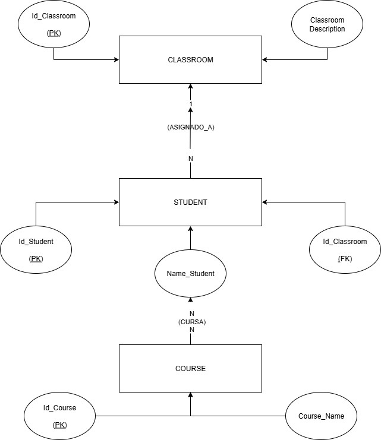
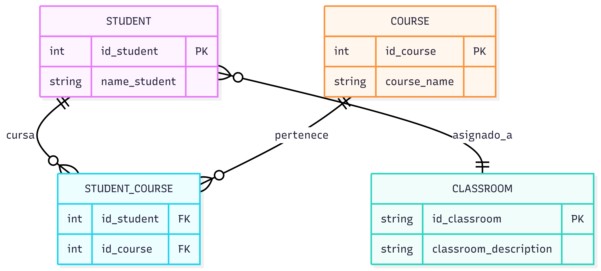

# Ejercicio de Normalización y Diagramas ER

## Instrucciones
Descarga el pdf donde encontrarás una tabla de datos sin normalizar  
Normaliza la tabla (se recomienda el uso de Google Sheets)  
Realiza un diagrama ER de Chen  
Realiza un diagrama de tipo patas de gallo  
Crea un repositorio con el Readme  
Inserta en el Readme la descripción del ejercicio así como los diagramas creados (puedes utilizar Mermaid)  

## Requisito
- Normalizar la tabla proporcionada (ver pdf)  
- Con diagrams.net realizar un diagrama de entidad-relación (de Chen)  
- Con diagrams.net realizar un diagrama UML (patas de gallo) de la base de datos con sus tablas, campos y relaciones.

## Tablas Normalizadas
Puedes ver las tablas normalizadas en el siguiente enlace:  
[Ver en Google Sheets](https://docs.google.com/spreadsheets/d/1L_bdChjj8PO8QjKvu6ePhcwsqbH9juSorIi0ji5QUFQ/edit?usp=sharing)

## Diagramas

### Diagrama ER de Chen

### Diagrama UML (patas de gallo)
